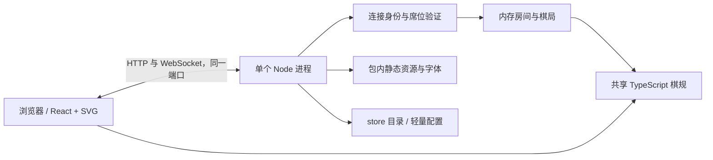

# Ink Chess · 水墨象棋

在宣纸与木色棋枰上对弈的中国象棋 Web 游戏。React / TypeScript / SVG 界面，Node.js 原生 HTTP 与 WebSocket 共用一个端口。用户运行时无需构建、数据库或额外服务。

> 当前为本地验收版本，尚未发布 npm。基本走法、将死、困毙与网络隔离已实现；**复杂 2020 竞赛棋例尚未全面认证**，范围见 [规则覆盖](docs/RULES.md)。不能将此版本宣称为完整竞赛裁判。

## 开发运行

需要 Node.js **22.12 或更新版本**。

```bash
npm ci
npm run build
npm start -- --mode local
npm start -- --mode local --mcp --store ./.store/chess
npm start -- --mode lan
npm start -- --mode server --store ./store_files
```

浏览器访问终端打印的入口。局域网本机玩家务必打开带 `#host=...` 的 loopback 专用入口；来客打开终端列出的局域网 IP 地址。`0.0.0.0` 是监听地址，应把本机实际 IP 发给来客。

正式发布后的入口（本阶段不发布）：

```bash
npx @scpz24/ink-chess --mode local
npx @scpz24/ink-chess --mode lan
npx @scpz24/ink-chess --mode server --store ./store_files
```

| 参数 | 默认值与说明 |
| --- | --- |
| `--mode local\|lan\|server` | `local` |
| `--mcp` | 显式开启本地 AI 对弈与 HTTP MCP；仅允许 local + loopback |
| `--port 5678` | 端口占用时报错，绝不静默切换 |
| `--host IP` | local 为 `127.0.0.1`，其余为 `0.0.0.0`；支持 IPv6 |
| `--store PATH` | 启动时的工作目录；相对路径相对工作目录解析 |
| `--trusted-proxy IP` | 默认无，可重复指定；仅信任精确 IP |
| `--help` / `--version` | 输出后退出，不创建目录 |

## 三种模式

- **local**：每个页面独立棋局，同一鼠标轮流控制红黑双方。红方先行。
- **lan**：一个直接 loopback 本机席位加一个外部席位。凭证每次启动重新生成，只在进程和 URL fragment 中保存。代理转发不能获得本机身份。第三人、重复标签页、同 IP 重连均不能顶替原席位。
- **server**：先填写昵称，再创建或加入房间。以实际 IP 区分在线玩家，一个 IP 同时一条连接、一个席位。共享 NAT 出口的用户会视为同一玩家，这是本模式既定限制。

网络模式的行棋、认输、提和、再局都由服务端验证。双方同意再局后交换颜色，本机/来客身份不变。任何一方断线或刷新都会中止正在进行的棋局；异常失联在心跳检测到后中止（通常 30–40 秒）。已有胜负结果不会被断线覆盖。

LAN 来客断线后，本机点击“接待新对手”方可开启新局。主机断线会同时释放来客。没有观战、悔棋、自动恢复或棋谱导出。



## 存储与偏好

所有运行时文件限定在 `--store`；不会写入 npx 缓存或 npm 安装目录。目录不存在时创建。目录不可写、指向文件或配置损坏都会报错。

不需要服务端持久化设置时，不创建配置文件。可按需在 store 中创建 `ink-chess.settings.json`：

```json
{
  "schemaVersion": 1,
  "mode": "server",
  "port": 5678,
  "host": "0.0.0.0",
  "trustedProxy": ["127.0.0.1"]
}
```

优先级为命令行 > 配置文件 > 内置默认；CLI 覆盖值不自动写回。配置模块提供临时文件加原子替换的写入接口。昵称、招式动画、音效和减少动态效果保存在 `ink_chess_preferences` Cookie。棋局、棋谱、连接、房间和裁定均只保存在内存，停止进程即清除。

开启 `--mcp` 时，还会在 `<store>/.codex/config.toml` 创建或更新本程序管理的项目级 MCP 区块。仅该区块随本次地址/端口更新，其他设置保留。不会修改全局 Codex 配置。详见 [Codex AI 对弈接入](docs/MCP.md)。

## 与 Codex 对弈

```bash
# 本地开发版本
npm run build
npm start -- --mode local --mcp --store ./.store/chess

# 正式发布后的同包入口
npx @scpz24/ink-chess --mode local --mcp --store ~/Games/InkChess
```

在 Codex 中打开终端打印的 **store 目录作为下棋项目**，信任该项目后新建任务或重新加载 MCP；浏览器打开终端打印的网页。给 Agent 的任务示例：

> 请通过浏览器与我下象棋。读取页面上的棋盘标识，用 enter_chess 加入，默认你执黑。你的每一步通过页面点击完成，然后用 wait_for_next_move 静默等待我落子；每次使用工具返回的事件游标。结束时调用 quit_chess。

Agent 仍需具备可用的 computer use 或 browser use 工具。象棋 MCP 只提供进入、等待、退出，不提供直接落子、截图或完整棋盘数据。人和 AI 共用同一页面，按执色交接，请勿代点 AI 的棋子。

等待先注册再开放人类的一着；返回例如“对方行棋：炮五平一。你可以继续观察棋盘行棋。”。服务收到取消通知、超时或连接断开时暂停交接；可重试或点击页面“退出 AI 对弈”。刷新页面会建立新棋局并结束旧会话。

**Codex 0.153.4 的已知验收限制：** 实测中断模型回合没有取消底层 MCP 等待，不能保证立即关闭人类权限。停止 Agent 后请点击页面“退出 AI 对弈”。完整复现与验证范围见 [MCP 接入文档](docs/MCP.md)。

## nginx

同机反向代理示例见 [nginx.conf](examples/nginx.conf)。应用启动时显式信任 nginx 的直连来源：

```bash
ink-chess --mode lan --trusted-proxy 127.0.0.1
```

nginx 必须**覆盖** `X-Real-IP` 为它直接看到的客户端 IP，并转发 WebSocket Upgrade。不要将客户端提交的 `X-Forwarded-For` 当作身份。若代理通过 IPv6 连接应用，另外配置 `--trusted-proxy ::1`。

本机玩家始终使用终端打印的直接 loopback 专用入口。不要把本机凭证放入 nginx 配置、Cookie 或给来客的链接。缺失可信真实 IP 的代理连接会被拒绝或无法取得席位。

## 界面与招式

界面按窗口方向固定为两种比例：横屏（宽 ≥ 高）为 16:9，左侧对局信息、中央棋盘、右侧逐着棋谱；竖屏为 9:16，仅显示双方身份、回合、当前状态和必要操作，隐藏棋谱及吃子列表。画面居中等比适配，多余区域留白；横竖切换保留当前棋局，棋谱在后台继续记录。竖屏 AI 对弈的棋盘标识可在偏好设置中查看。支持棋盘翻转、合法落点、上一着标记、吃子显示与键盘选中。将死和困毙落子后立即结算，动画不影响规则。

招式包含当头炮、过宫炮、打死车、马后炮、双炮、对面笑。只在新招式形成时播放，普通约 900ms，将死约 1400ms；同着按优先级选主动画，余者作标签。阵形本身不代表必胜。字体随包分发，音效由浏览器合成，运行时没有 CDN 或素材服务请求。

## 验证与打包

```bash
npm test
npx playwright install chromium
npm run build
npm run test:e2e
npm run test:docker       # Docker Desktop / Docker Engine 已启动
npm run test:package      # npm pack + 全新目录安装 + 三种模式启动
npm run test:codex        # 已登录且信任当前项目的真实 Codex 验收；包含65秒等待及一次模型调用
```

Docker 验收使用独立临时网络和两个真实来客容器；nginx 与应用共享网络命名空间，确实从 loopback 转发。结束后自动删除测试容器和网络。测试不修改生产配置、不发布包。

`npm pack` 的产物包含 bin、编译后的服务端/规则、网页、字体和许可证。`private: true` 暂时阻止误发布；正式发布时需在完成棋例认证后明确移除此标志，使用 `npm publish --access public`。

许可证：MIT；第三方组件与字体见 [THIRD_PARTY_NOTICES.md](THIRD_PARTY_NOTICES.md)。
