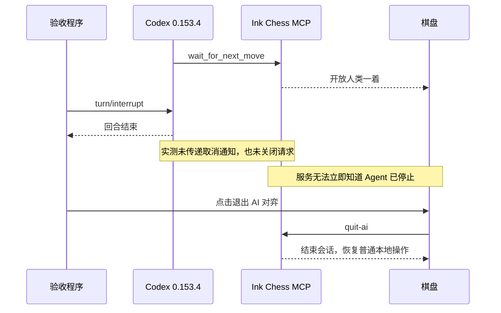

# 本地 AI / MCP 验收记录

日期：2026-09-22。工作区：`/Users/zytwd/Code/GoodLooks/ChineseChess`。
环境：Node 22.23.2、Codex CLI / app-server 0.153.4、Chromium。
未发布 npm，未修改用户级 Codex 配置，未分配开发子 Agent。

## 已通过的自动化验收

| 检查 | 结果与范围 |
| --- | --- |
| `npm run build` | TypeScript、Vite、Node 产物构建通过 |
| `npm test` | 8 个文件、76 项通过；包括原有规则与网络测试 |
| `npm run test:e2e` | 8 项通过；保留普通本地、LAN、服务模式，新增 MCP 浏览器交接 |
| `npm run test:package` | 全新目录安装 tarball，通过 local / lan / server 及 IPv4、IPv6 local+MCP |
| 项目配置 | 管理区块更新、保留用户内容、损坏 TOML、同名冲突、只读文件、符号链接、全局目标拒绝、不重复改写 |
| 数据边界 | 包目录只读可运行且内容哈希不变；生成配置仅在 store；静态 HTTP 不暴露配置；没有棋谱落盘 |

交接测试覆盖：红先黑后、先注册等待再放行、非法着法、重复等待、未来/旧游标、响应重放、
取消与落子竞争、1740 秒超时、旧会话退出不影响新会话、页面失联、提和回应、认输、实际将死和新局。
HTTP 测试使用官方 MCP 客户端，不只调用内部状态机；请求取消和连接关闭均会暂停权限。
浏览器用真实点击验证交接锁、退出恢复、刷新失效，并检查 390px 窄屏与桌面效果。

安装包：`scpz24-ink-chess-0.1.0.tgz`。通过本地 tarball 的 `npm exec` 检查命令入口，
生产依赖安装不需要源码或构建工具。IPv6 端口冲突测试使用同一监听地址，
避免误把 IPv4 与 IPv6 上的独立监听当成冲突。

## 真实 Codex 验收与尚未通过项

测试脚本：`scripts/test-codex-mcp.mjs`。它运行已安装的真实 Codex app-server，
在受信任仓库下创建两个临时兄弟项目，只有下棋项目拥有 `.codex/config.toml`。
测试前后比较用户级配置字节，结束删除临时目录。临时模型会话只执行对弈验收。

- 下棋项目发现三个工具；另一独立项目没有发现 ink-chess，游戏后台运行不改变结果。
- `wait_for_next_move` 挂起 65 秒后，浏览器人类落子使工具返回中文棋谱。
- 模型读取工具 observation 后继续执行的流程使用真实模型，不以模拟客户端替代。
- 连续两回合对弈通过：人类走“兵九进一”“兵七进一”，真实模型通过 browser use
  读取 DOM、点击网页，走出“卒1进1”“卒3进1”。产品中仍只有三个 MCP 工具。
- 中断后页面“退出 AI 对弈”恢复操作通过；用户级配置前后字节相同。
- **Codex 主动中断未通过。** 调用 `turn/interrupt` 后，已观察到模型回合结束，
  但 MCP 端未收到 `notifications/cancelled`，等待 HTTP 请求也没有关闭。
  因而没有可供游戏服务判断“用户已取消”的信号，人类权限未立即暂停。

正常 MCP 取消与 Codex 回合停止是不同检查。脚本将后者保留为失败，不将页面退出替代方案计为通过。
复现只需 `node scripts/test-codex-mcp.mjs --cancel-only`；完整验证用 `npm run test:codex`。
修复该客户端行为后应重跑；服务端无法在没有信号的前提下可靠推断取消。

本次使用的 `turn/interrupt` 与动态浏览器工具接口符合
[Codex App Server 文档](https://learn.chatgpt.com/docs/app-server)。
文档规定轮次中断接口；以上 MCP 取消缺失结论来自本机 HTTP 实测。

**状态：实现、自动化与安装包已验证；原计划的全部完成标准尚未满足，剩余项是实际 Codex 中断传播。**
