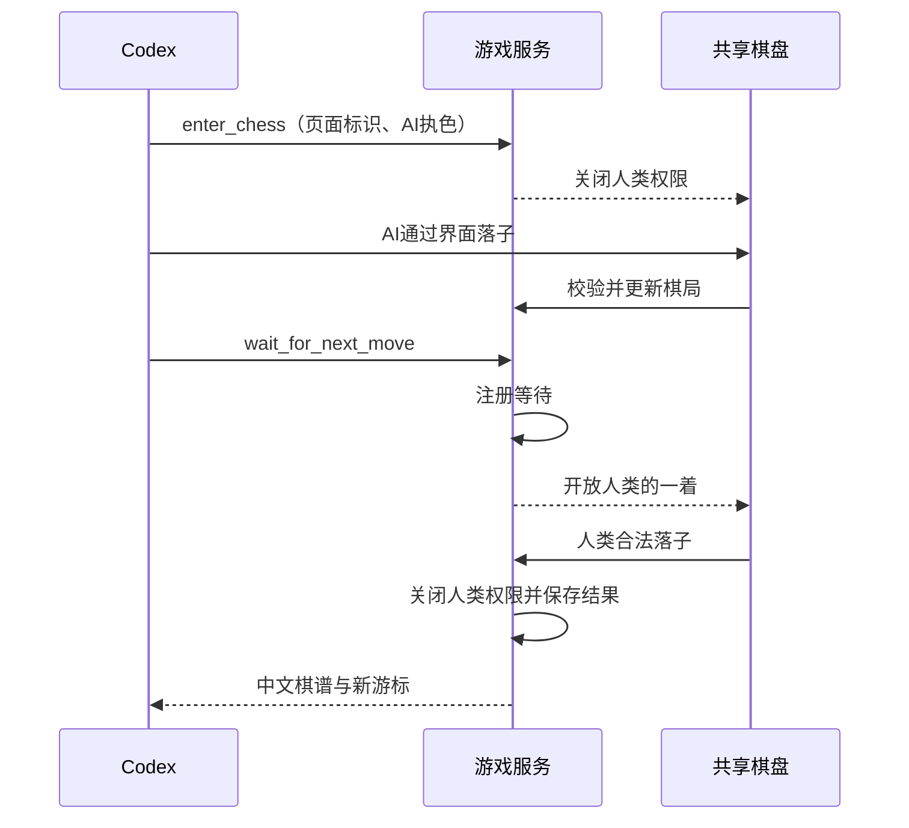

# Codex 本地 AI 对弈

启动 `ink-chess --mode local --mcp`，或发布后的 `npx @scpz24/ink-chess --mode local --mcp`。
服务仅监听 loopback，网页、WebSocket、Streamable HTTP MCP 共用端口（默认 5678）。
不支持 LAN/server 模式，不支持公网 MCP、stdio 或 Pi 专用适配。

## 项目级配置

所有生成文件位于 `--store`；未指定时使用启动目录。MCP 配置是
`<store>/.codex/config.toml`，必须在 Codex 中打开并信任对应目录。
使用自定义 store 后，Codex 不会自动从别的工作区读取配置。

```toml
# BEGIN ink-chess managed MCP
[mcp_servers.ink-chess]
url = "http://127.0.0.1:5678/mcp"
tool_timeout_sec = 1800
enabled_tools = ["enter_chess", "wait_for_next_move", "quit_chess"]
# END ink-chess managed MCP
```

地址跟随实际 host/port，支持 IPv6。程序只更新管理标记中的内容。
文件损坏、同名非托管配置、异常标记、不可写路径或符号链接不会被覆盖。
配置写入失败会关闭本次服务；端口占用不会生成配置。
不能以用户主目录为 store 覆盖全局 `.codex/config.toml`。

停止服务后项目配置保留。其他未配置该服务的项目不会加载下棋工具，即使服务仍运行。
同项目下的其他任务也可能加载工具；如需隔离，建立下棋专用工作目录。
已有任务的对话历史不会因切换 shell 工作目录而清空。更改配置后重新加载 MCP 或新建任务。

## 三个工具

| 工具 | 参数 | 作用 |
| --- | --- | --- |
| `enter_chess` | `board_id`，`ai_side` 默认 `black` | 从页面读取棋盘标识，绑定独占 AI 会话，锁住人类权限 |
| `wait_for_next_move` | `session_id`，`after_event_seq` | 确认交接条件后开放人类行动；等待落子、提和回应或终局 |
| `quit_chess` | `session_id` | 结束会话与等待，保留局面并恢复本地操作 |

每次使用返回的 `event_seq` 作为下一次等待游标。响应丢失时以原游标重试，返回缓存结果而不多放行一着。
会话独立于 MCP 传输连接，但绑定具体页面与棋局。不能接管另一标签页或刷新后的新局。



AI 执黑时首次直接等待人类的红方首着。AI 执红时先通过页面落子。
返回不含 FEN、棋盘数组、坐标或建议着法。

```json
{
  "status": "opponent_moved",
  "session_id": "…",
  "event_seq": 1,
  "notation": "炮五平一",
  "message": "对方行棋：炮五平一。你可以继续观察棋盘行棋。"
}
```

终局返回 `game_over` 和胜负原因；需要回应提和时返回 `action_required`，通过页面接受或拒绝。
普通交接同一时刻只允许一个等待。AI 尚未完成行动就等待会报错，非法点击不唤醒。

## 等待、取消与恢复

- 单次服务端等待 1740 秒，Codex 配置为 1800 秒；这不是象棋计时规则。
- 等待没有进度文本，不轮询模型。服务收到 MCP 取消通知、等待连接断开或超时时产生 `paused`，关闭人类权限。
- 收到 `paused` 后，可用其游标重试；取消导致结果未收到时，原游标可取回暂停事件。
- 人类落子和取消竞争时，以服务端串行处理顺序为准；已成功落子不会被撤回。
- 浏览器失联由心跳确认（约 30–40 秒），结束旧会话；页面刷新不恢复棋局。
- 退出后会话结果在内存保留 30 分钟供重试，然后过期。服务重启清空全部会话。
- 页面“退出 AI 对弈”始终可在已连接状态下操作，不依赖 Agent 继续响应。

同页面无法区分真实鼠标与 computer use 的点击。系统按执色和交接阶段限制操作，人类约定不代点 AI 棋子。
项目级工具可见性由 Codex 的项目配置控制；本机 MCP 地址本身不提供跨操作系统用户的身份隔离。

**已知 Codex 限制（0.153.4，2026-09-22 实测）：** `turn/interrupt` 会停止模型回合，
但本机实测中没有发送 MCP `notifications/cancelled`，也没有断开正在等待的 HTTP 请求。
游戏服务因而无法立即感知这次停止，人类行动权限仍保持开放，直到落子、服务等待超时或退出。
停止 Agent 后请点击页面的“退出 AI 对弈”；该入口会立即结束等待并恢复普通本地操作。
标准 MCP 客户端的取消和断线测试通过，不能据此宣称 Codex 的停止按钮也已通过。
这个客户端行为仍是完整验收的未通过项，不以缩短等待、轮询模型或监视 Codex 内部文件绕过。

## 验收

`npm test`：规则、交接、HTTP工具和配置；`npm run test:e2e`：浏览器真实点击；
`npm run test:package`：全新目录安装 tarball，验证只读包、MCP运行依赖及 store 边界。

`npm run test:codex` 使用本机已登录的 Codex app-server，必须已信任当前仓库。
它在仓库 `.store` 内生成临时兄弟工作目录，验证项目级发现与隔离、65秒工具等待，
以及真实模型通过测试专用 browser use 工具点击页面、连续两个回合交接和主动取消。
browser use 测试工具只读取页面 DOM 和执行 Playwright 点击，不调用落子接口，不包含在产品 MCP 中。
临时会话不承担开发工作；测试不修改用户级 Codex 配置，结束清理临时目录。
需要 Chromium 已安装（可通过 `PLAYWRIGHT_BROWSERS_PATH` 指定位置）。此验收会消耗模型调用的账户额度。
主动取消未生效时脚本明确退出失败，即使其他检查通过；可使用
`node scripts/test-codex-mcp.mjs --cancel-only` 单独复现取消与页面恢复检查。
