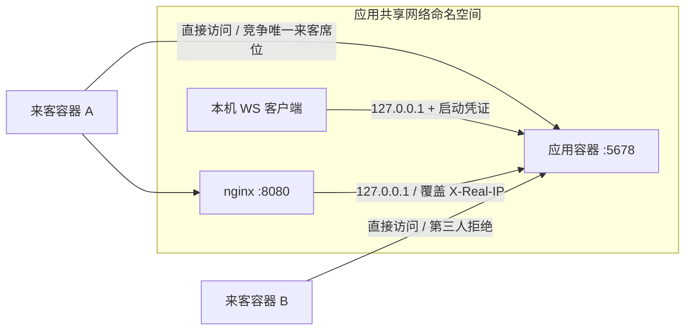

# 本机验收记录

日期：2026-09-22。平台：macOS arm64，Node 22.23.2，npm 12.0.2，Docker Desktop，Playwright Chromium。

| 检查 | 结果 |
| --- | --- |
| `npm run build` | TypeScript 检查、Vite 网页构建、Node ESM 编译通过 |
| `npm test` | 5 个测试文件、56 项通过 |
| `npm run test:e2e` | 6 项通过，本地、LAN、房间流程及窄屏布局 |
| `node scripts/test-docker.mjs` | 全部通过，测试容器和网络自动清理 |
| `npm run test:package` | 本地 tarball、全新安装、三种模式、只读包与 store 隔离通过 |
| 完整 2020 竞赛棋例 | **未通过完整认证**，见 [RULES.md](RULES.md) |
| npm 发布 | 未执行 |

浏览器验收截图：[桌面](screenshots/desktop.png)、[390px 窄屏](screenshots/mobile.png)。本机浏览器安装到了临时目录，验收时使用 `PLAYWRIGHT_BROWSERS_PATH=/private/tmp/ink-chess-browsers`；其他开发者执行 `npx playwright install chromium` 即可使用默认目录。

发现并修复的实际问题：HTTP 局域网环境下缺少 `crypto.randomUUID`、提和状态在己方落子后被错误清除、重复棋例中把不变的原有攻击误记为新捉、网页未读完字体响应导致服务停止等待。以上均有自动化回归用例。

Docker 拓扑：

`tests/docker/peer.mjs` 的控制接口仅存在于临时验收容器，源码不进入 npm 包，也不是游戏运行时接口。
